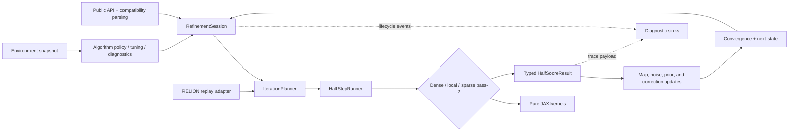

# Dense Single-Volume EM Refactor Plan

Status: active; C1--C4 audited, C4.5 consolidation required before C5

Created: 2026-09-08

Scope: `recovar/em/dense_single_volume/` and its direct tests/callers

Progress log: [`dense_single_volume_refactor_progress.md`](dense_single_volume_refactor_progress.md)

C1--C4 audit:
[`dense_single_volume_refactor_audit_2026-09-11.md`](dense_single_volume_refactor_audit_2026-09-11.md)

C4.5 inventory:
[`dense_single_volume_refactor_c45_inventory.md`](dense_single_volume_refactor_c45_inventory.md)

## 1. Goal

Refactor dense single-volume EM so that the control flow, data ownership, and
algorithm variants are easy to understand and change without altering the
algorithm. The refactor should:

- replace long, repetitive argument lists with small cohesive request, state,
  policy, and result objects;
- keep the numerical kernels functional and compatible with JAX transforms;
- move environment parsing, debug dumps, parity captures, and experimental
  overrides out of the normal algorithm path as far as their semantics allow;
- make intentionally distinct implementations explicit, while consolidating
  only implementations proven equivalent under the applicable numerical
  contract;
- split very large orchestration modules into components with clear ownership;
- preserve output quality, convergence/finalization behavior, compilation
  behavior, memory use, and runtime.

This is a structural refactor. It does not authorize changes to score formulas,
candidate generation, posterior support, reduction order, dtype, random-number
use, image order, M-step accumulation order, convergence rules, or RELION
compatibility semantics.

### 1.1 Outcome contract

Readability, deletion, and replacement are deliverables, not hoped-for results
of file extraction. The C1--C4 audit found that production Python grew from
67,999 to 71,509 lines while functions with at least 20 arguments fell from 38
to 37. The plan therefore uses the following rules from C4.5 onward:

- report production, tests, and documentation separately; test or documentation
  growth never offsets production growth;
- distinguish a true replacement from an additive wrapper: a typed request is
  not complete while normal production flow expands it into the old long
  signature and parses the old tuple result;
- delete a superseded internal representation in the same phase that replaces
  it; temporary compatibility code needs an owner, real consumer, removal
  condition, and expiry phase;
- do not pass a phase merely by moving the same code into more modules or adding
  names around it;
- measure total/nonblank lines, files, functions, classes, long function
  signatures, long calls, maximum function size, compatibility adapters,
  duplicate implementations, environment boundaries, import cycles, and the
  applicable quality/performance gates after every accepted slice;
- keep a small type only when it names an independently testable decision,
  crosses a meaningful boundary, or prevents invalid state. Inline or merge it
  when it only renames local variables, duplicates a parent request, or bridges
  two representations that should no longer coexist.

These are complexity guardrails, not permission to compress code, merge
numerically distinct kernels, or weaken clarity. If a quantitative target
cannot be met safely, pause and revise the plan with the user instead of
claiming completion or making algorithmic changes.

## 2. Provenance and baseline

The inventory in this document was made from:

- branch: `double_parity_refactor`;
- HEAD: `1e2f229b3e0e8edaec029d2b604937f692148578`;
- tracked diff at inventory time: empty;
- tracked diff SHA-256: `e3b0c44298fc1c149afbf4c8996fb92427ae41e4649b934ca495991b7852b855`;
- required parity ancestors: all five present;
- untracked manifest: 1,427 files, all under the pre-existing `.vscode/`,
  `_agent_scratch/`, fixture, plot, and RELION-output directories reported by
  `git status`. These are not refactor inputs and must not be modified.

An existing run of the user-specified full K=1 command is available at
`$HOME/palmer_scratch/tmp/recovar_em_test_regenerated`. Its
`benchmark_ledger.json` records the same HEAD and provides the initial quality
reference:

| Metric | Baseline |
|---|---:|
| Completed numbered iterations | 13 |
| Final all-data path | ran |
| Current-size trajectory | `46, 46, 72, 70, 70, 70, 70, 70, 70, 72, 72, 72, 72` |
| Final merged correlation versus RELION | `0.9985789461317439` |
| Final merged FSC-AUC versus RELION | `0.995855447698812` |
| End-to-end elapsed time | `1184.1040608882904 s` |

The artifact is a valid same-HEAD quality reference. It does not record enough
hardware identity to be the sole performance comparator. Before the first
performance-sensitive implementation slice, make a fresh baseline and candidate
run in the same Slurm `gpu` allocation and record GPU UUID/model, driver, JAX,
batch sizes, compilation treatment, peak memory, and stage timings.

## 3. Current-state inventory

At the baseline above, the package contains 56 Python files, 67,999 lines, and
1,124 functions. Static AST inventory found:

- 125 functions with at least 10 parameters;
- 59 functions with at least 15 parameters;
- 38 functions with at least 20 parameters;
- 341 calls with at least 10 arguments;
- 133 calls with at least 15 arguments;
- 81 calls with at least 20 arguments;
- 206 resolved `RECOVAR_*` environment names read inside the package;
- one direct import cycle:
  `helpers.significance` <-> `helpers.sparse_pass2_bucketed`.

The counts are baselines for a ratchet, not goals by themselves. Moving 50
unrelated fields into a single opaque “context” would improve the count and
make the design worse.

### 3.1 C4 audit checkpoint

The 2026-09-11 audit measured the completed C4 implementation at `6041093d`:

| Measure | Baseline | C4 | Change |
|---|---:|---:|---:|
| Production Python files | 56 | 75 | `+19` |
| Production lines | 67,999 | 71,509 | `+3,510` |
| Functions/methods | 1,124 | 1,254 | `+130` |
| Classes | 75 | 165 | `+90` |
| Functions with >=15 args | 59 | 58 | `-1` |
| Functions with >=20 args | 38 | 37 | `-1` |
| Calls with >=15 args | 133 | 125 | `-8` |
| Calls with >=20 args | 81 | 75 | `-6` |

The environmental and diagnostic boundaries are real improvements, and the
local big-JIT signature improved from 98 arguments to eight grouped arguments.
However, typed local/dense/local-search entry points still delegate to their
legacy long-signature implementations and translate legacy tuple results back
to typed results. C4.5 corrects this additive migration before further
component extraction. Full evidence and phase-by-phase findings are in the
[C1--C4 audit](dense_single_volume_refactor_audit_2026-09-11.md).

### 3.2 Main hotspots

| File/function | Size or signature | Main concerns |
|---|---:|---|
| `iteration_loop.py` | 10,374 lines | Controller, replay, diagnostics, half scoring, reconstruction, convergence, and finalization share one module. |
| `_run_relion_iteration_loop` | 5,564 lines | One function owns nearly the whole refinement lifecycle. |
| `helpers/sparse_pass2_bucketed.py` | 19,436 lines | K=1/K-class execution, planning, scoring, posterior logic, M-step, tuning, capture, and dump I/O are interleaved. |
| `compute_pass2_stats_sparse_bucketed` | 61 args, 4,155 lines | Host orchestration and experimental/debug behavior are mixed with production execution. |
| `compute_k_class_pass2_stats_sparse_fused` | 46 args, 3,704 lines | Repeats much of the K=1 lifecycle with class-axis variants. |
| `local_em_engine.py` | 5,234 lines | Request validation, environment parsing, cache/planning policy, debug filtering, bucket execution, postprocessing, and I/O are mixed. |
| `run_local_em_exact` | 58 args, 3,348 lines | Public API, execution plan, and diagnostics are one boundary. |
| `local_big_jit.run_local_bucket_big_jit` | 98 args, 843 lines | The JIT boundary exposes every dynamic array and static switch individually. |
| `em_engine.run_em` | 39 args, 1,587 lines | Dense orchestration still has tuple-shaped optional outputs and repeated policy plumbing. |
| `_score_half_dense` / `_score_half_local` | 58 / 56 args | Iteration state is unpacked and repacked across branches. |
| `_run_local_search_iteration` | 71 args | Local-search orchestration mirrors much of the half-step state manually. |
| `helpers/significance.py` | 3,958 lines | Production significance logic and capture/debug paths are intertwined. |

Examples of the plumbing problem include a 100-line, 98-argument call to
`run_local_bucket_big_jit`, multiple 50- to 64-line calls from the iteration
loop into half scorers, and result tuples whose shape changes with flags.

### 3.3 Existing foundations to retain

The refactor should build on, not discard, the following existing work:

- `RefinementOptions` and its schedule, adaptive, parity, local-search,
  K-class, replay, debug, and batching groups;
- `DensePrecisionPolicy` as the central dtype contract;
- `HalfScoreResult` and `PerHalfOutputs` as the start of a typed half-step
  boundary;
- `DenseBucketResult`, `KClassEMResult`, `NoiseStats`, `RelionStats`, and the
  typed mean-update results;
- `LocalHypothesisLayout`, `LocalBucketSpec`, `FourierWindowSpec`, and
  `DenseScoreConstraints` as cohesive value objects;
- separation of `dense_big_jit.py` from dense host orchestration and
  `local_big_jit.py` from local host orchestration;
- the resolved ownership decisions in `docs/relion_local_engine_refactor.md`,
  including the direct packed-half local adjoint contract and the negative
  result for local projection deduplication.

### 3.4 Distinct concerns currently hidden behind flags

Environment-controlled behavior falls into four different categories and must
not remain one undifferentiated set:

1. **Algorithm/parity policy**: first-iteration score/reconstruction policy,
   exact RELION scoring/translation/projector behavior, x-half M-step behavior,
   final-all-data semantics, precision, and replay ownership.
2. **Performance tuning**: cache sizes, bucket quantization, microbatch caps,
   compact-row thresholds, fusion choices, and progress cadence.
3. **Passive diagnostics**: stage timing, array dumps, score/posterior capture,
   membership capture, and projector capture that do not select production
   outputs.
4. **Invasive experiments**: target-only execution, stop-after-target,
   force-split, state swaps, reversed execution order, or shadow arithmetic
   that intentionally changes control flow or resource use.

Only category 1 belongs to the algorithm configuration. Category 2 belongs to
a typed execution-tuning snapshot. Categories 3 and 4 belong to a diagnostics
package, and invasive experiments must remain visibly labeled as such.

## 4. Architectural rules

### 4.1 Preserve JAX style

The host controller may be object-oriented; numerical kernels remain pure
functions over array PyTrees plus small immutable static policies.

- Dynamic JAX values live in `NamedTuple`s or registered PyTree dataclasses.
- Static values live in frozen, hashable dataclasses and are passed as static
  arguments only when they actually affect tracing.
- Host-only objects such as datasets, paths, loggers, writers, and caches never
  enter JIT argument trees.
- No Python I/O, environment lookup, mutable global, or NumPy host conversion
  is introduced inside compiled kernels.
- Array grouping must preserve leaf order, donation opportunities, shapes,
  dtypes, and sharding. Lowered HLO and compilation-cache behavior are checked
  before accepting a JIT-boundary rewrite.
- A structural bundle is not allowed to cause per-batch recompilation. Static
  policy values should vary only where the current static arguments vary.

### 4.2 Prefer cohesive objects, not a god context

Each object must have one owner and one reason to change. Functions should
usually accept three to seven logical arguments. The target is not a single
`EverythingContext`; the target is a small composition such as:

```text
run_local_bucket(arrays, accumulators, geometry, policy, trace_spec)
    -> LocalBucketResult
```

The object categories are:

- **refinement inputs**: immutable datasets, initial maps/noise/prior, and base
  sampling grids;
- **carried state**: values produced by iteration N and consumed by N+1;
- **iteration plan**: derived current-size, sampling, scoring, reconstruction,
  batching, and finalization decisions for one numbered iteration;
- **half-step request**: one half's dataset view, state view, model view,
  corrections, priors, and search plan;
- **kernel arrays**: only dynamic arrays needed by one numerical stage;
- **static kernel policy**: shapes, mode enums, numerical switches, and exact
  backend identity;
- **results**: stable typed outputs with optional fields represented explicitly,
  never by changing tuple position;
- **observability**: trace requests and host-side sinks, separate from results.

### 4.3 Make ownership transitions explicit

The target data flow is:



`RefinementSession` is host orchestration, not a JAX object. It owns immutable
inputs/options/runtime objects and advances an explicit state through stage
functions. The numerical engines do not reach back into the session.

### 4.4 Preserve named numerical variants

Mathematically equivalent implementations are not necessarily numerically or
operationally equivalent. The following differences can be load-bearing:

- float32 versus float64 intermediates;
- algebraic Gaussian scoring versus source-faithful RELION reduction trees;
- dense, compact-pair, active-row, and rectangular reductions;
- JAX interpolation versus RELION texture interpolation;
- native half-volume versus RELION x-half accumulation;
- batched versus per-particle launch order;
- soft posterior versus first-iteration hard winner;
- full support versus RELION significance pruning.

Represent these as named policies/backends selected once by orchestration. Do
not bury them in generic booleans deep in kernels. A path may be removed or
merged only after tests demonstrate the required equality for every supported
dtype/mode, or after it is formally classified as diagnostic/dead and removed
with its callers and tests.

## 5. Target component boundaries

The exact filenames may evolve during implementation, but dependencies should
point downward in this order:

```text
dense_single_volume/
  api.py or iteration_loop.py facade
  refinement_options.py
  runtime_options.py
  controller/
    session.py
    planning.py
    half_step.py
    updates.py
    finalization.py
  engines/
    types.py
    dense.py
    local.py
    local_kernel.py
    sparse_pass2/
      types.py
      planning.py
      inputs.py
      scoring.py
      posterior.py
      mstep.py
      noise.py
      engine.py
  replay/
    model_reader.py
    policy.py
    apply.py
  diagnostics/
    config.py
    events.py
    sinks.py
    schemas.py
    local_capture.py
    sparse_capture.py
```

Avoid a large path-only reorganization up front. First introduce typed seams in
the existing modules, then move cohesive code with compatibility re-exports.
This keeps diffs reviewable and lets tests isolate semantic changes from module
moves.

### 5.1 Proposed central types

Names are provisional; their responsibilities are not.

| Type | Contains | Must not contain |
|---|---|---|
| `RefinementInputs` | two datasets, initial volumes/noise/prior, base rotations/translations | debug paths, mutable iteration state |
| `RuntimePolicies` | precision, scoring, projection, M-step, replay, finalization policies | arrays or output paths |
| `ExecutionSettings` | batch/microbatch/cache/bucket/fusion thresholds | algorithm semantics or capture requests |
| `DiagnosticsPlan` | passive captures, trace levels, invasive experiments, output sinks | production numerical defaults |
| `IterationState` | carried means, noise, tau2, corrections, pose state, priors, convergence state | dataset or environment access |
| `IterationPlan` | current-size, search grids, perturbation, route, batch plan, reconstruction plan | prior/next mutable state |
| `HalfStepRequest` | one half's state/model/search/correction views | global output mutation |
| `EngineResult` | stable E-step, M-step, noise, pose, support, profile outputs | flag-dependent tuple layout |
| `LocalBucketArrays` | dynamic arrays for one local JIT bucket | paths, environment, mutable cache |
| `LocalBucketStatic` | trace-affecting modes/shapes only | dynamic arrays |
| `LocalBucketAccumulators` | input accumulator PyTree | diagnostic state |
| `LocalBucketResult` | updated accumulators, posterior/stat outputs, optional trace payload | file I/O |
| `SparsePass2Request` | problem/search/correction/state groups for one sparse call | environment reads |
| `TraceSpec` | static identity of requested extra kernel outputs | sink implementation |

## 6. Diagnostics and environment separation

### 6.1 Parse once at the boundary

Add one compatibility parser that snapshots supported environment values before
the refinement starts. It produces three independent objects:

```text
EnvironmentSnapshot
  -> RuntimePolicies overrides
  -> ExecutionSettings
  -> DiagnosticsPlan
```

The environment remains backward compatible during the refactor, but engines
must consume typed values rather than call `os.environ` themselves. Add a
source-level test that ratchets direct environment reads toward the boundary.

### 6.2 Event and sink model

Algorithm code should emit small lifecycle events or return an explicitly
requested trace payload. Host-side sinks perform serialization:

- `IterationStarted`, `HalfScored`, `MstepAccumulated`, `MapsUpdated`,
  `ConvergenceUpdated`, and `IterationFinished` for lifecycle data;
- score, posterior, operand, membership, projector, and BPref payload schemas
  for targeted captures;
- `NullDiagnostics` for the production path;
- `NpzDiagnostics`, `ParityDiagnostics`, and timing sinks as host adapters.

No generic event bus is needed. A small protocol with no-op methods is enough.
Calls should occur at existing host synchronization points so the null sink
does not force device synchronization.

### 6.3 Passive versus invasive diagnostics

Every request must declare one of:

- `PASSIVE`: observes values already computed by the production path;
- `SHADOW`: performs additional arithmetic but production outputs remain
  authoritative;
- `INVASIVE`: intentionally changes routing, execution order, scope, or stop
  conditions.

Invasive requests must be rejected unless an explicit diagnostic mode is
enabled. Their result metadata must say that it is not a production-quality or
performance run. This preserves useful parity tools without letting them make
the normal algorithm unreadable.

## 7. Work breakdown

Each component is delivered as small reviewable slices. A slice should normally
change one boundary and add or update focused tests. Compatibility belongs at a
genuine external edge, not between two in-package representations. A slice that
introduces a migration adapter must either remove it after migrating callers in
the same phase or record its owner, consumer, deletion condition, and expiry.

C1--C4 are historical completed phases. Their numerical/performance gates
remain accepted, but the 2026-09-11 structural audit supersedes any claim that
their host interfaces are fully migrated. C5 is blocked until C4.5 passes.

### C0. Freeze behavior and add structural guardrails

Deliverables:

- record the fresh paired GPU quality/performance baseline before the first
  performance-sensitive edit;
- add deterministic fixtures for stable result-field comparison at engine and
  half-step boundaries;
- add AST-based ratchets for argument-count hotspots, environment reads below
  the configuration boundary, import cycles, and flag-dependent tuple unpacking;
- document which outputs are required in every result and which are optional;
- capture JAX compile count/cache-key and representative lowered-HLO summaries
  for dense, local, and sparse kernels.

Exit criteria:

- no test changes a tolerance merely to establish the baseline;
- baseline artifacts include exact commit, dirty fingerprint, GPU identity,
  command, environment, wall/stage times, peak memory, and output metrics.

### C1. Stabilize public and internal data contracts

Deliverables:

- keep `refine_single_volume(..., options=RefinementOptions)` as the public
  compatibility facade;
- replace flag-dependent tuples from dense/local/sparse engines with stable
  typed result objects;
- define `RefinementInputs`, `IterationState`, `IterationPlan`,
  `HalfStepRequest`, and engine request/result types;
- add conversion adapters at old call sites, then migrate production callers;
- avoid moving numerical code in the same slice.

Exit criteria:

- production call sites no longer unpack variable-length result tuples;
- result fields, shapes, dtypes, and `None` semantics match the old API;
- external imports continue to work through explicit re-exports.

### C2. Centralize policy and environment parsing

Deliverables:

- classify all direct environment reads into algorithm, tuning, passive
  diagnostics, or invasive experiments;
- move reads into `runtime_options.py` and `diagnostics/config.py`;
- promote major algorithm behavior to typed options with RELION-compatible
  defaults; keep environment aliases as a compatibility layer;
- validate conflicting settings once before any device work;
- make logs print the resolved policy, not scattered raw environment values.

Exit criteria:

- dense/local/sparse numerical kernels contain no environment reads;
- host engines receive a resolved policy/tuning/diagnostics object;
- existing environment-driven tests pass unchanged or through compatibility
  parsing with identical resolved values.

### C3. Extract diagnostics and parity capture

Deliverables:

- move serialization and schema-specific writing out of
  `iteration_loop.py`, `em_engine.py`, `local_em_engine.py`,
  `helpers/significance.py`, and `helpers/sparse_pass2_bucketed.py`;
- consolidate `debug_dumps.py`, `local_debug.py`, `parity_dump.py`, compact
  candidate capture, projector capture, and sparse/BPref capture behind typed
  sinks while retaining stable artifact schemas;
- pass a small `TraceSpec` to kernels only when additional device values are
  required;
- separate passive, shadow, and invasive routes visibly;
- keep stop-after-target exceptions and exit behavior in diagnostics adapters,
  not in numeric helpers.

Sequencing note: C3 moves artifact persistence, stable schema ownership, and
diagnostic policy behind adapters. Raw capture inputs may still be gathered at
the host boundary where the values already exist. Moving that gathering before
the C4--C7 request/state types exist would require new dictionary bags or long
`**kwargs` bridges, both of which conflict with this plan's primary interface
goal. Each engine/controller phase must move its remaining raw payload assembly
when it introduces the corresponding cohesive request or state object.

Exit criteria:

- the null-diagnostics route has the same outputs, synchronization points, HLO,
  compilation count, and timing envelope as the baseline;
- existing NPZ keys/dtypes/shapes and filename rules remain compatible;
- diagnostic tests demonstrate that passive capture does not select outputs.

### C4. Refactor the exact-local engine

Deliverables:

- introduce cohesive local request groups for model, search, corrections,
  reconstruction, normalization, and output selection;
- split `run_local_em_exact` into validation/planning, cache preparation,
  bucket execution, host postprocessing, and result finalization;
- replace the 98-argument local big-JIT boundary with grouped dynamic PyTrees,
  accumulator state, and one frozen static policy;
- replace the large positional return with `LocalBucketResult`;
- keep split, deferred-M-step, cache, score-only, and exact x-half routes as
  named execution modes until equivalence tests permit consolidation;
- retain the direct packed-half adjoint and do not reintroduce projection
  deduplication without new benchmark evidence.

Exit criteria:

- production local call sites use the typed request;
- representative lowered HLO has the same numerical operations and dtype/layout
  contract;
- no increase in shape-class/JIT compile count;
- local focused tests, fast guard, and paired warm timing pass.

Audit result: the grouped big-JIT boundary and extracted ownership passed, but
the host migration remained additive. `run_local_em(request)` still expands to
the historical `run_local_em_exact(...)` signature and converts its tuple back
to a typed result. C4.5 must finish this replacement before C5.

### C4.5. Consolidate the C1--C4 foundations

Purpose: turn the existing scaffolding into a smaller authoritative design
before introducing sparse-pass-2 types or modules. This phase changes host
ownership and compatibility direction only; it does not change numerical
operations, JAX array order, dispatch policy, or diagnostic schemas.

Deliverables, in order:

1. Inventory every C1--C4 compatibility adapter, legacy tuple converter,
   re-export shim, raw settings dictionary, and newly introduced plan/result
   class. Record its production consumers and classify it as canonical,
   external compatibility, independently meaningful, merge candidate, or dead.
2. Make `run_local_em(LocalEMRequest) -> LocalEMResult` the canonical
   implementation. Move the existing body mechanically behind this boundary,
   migrate every in-package caller, and make any required long-signature entry
   point a thin one-way external adapter into the typed core.
3. Apply the same adapter inversion to `run_dense_em` and typed local-search
   execution. Production flow must never be
   `typed -> legacy signature -> tuple -> typed`.
4. Remove `legacy_runner` injection, signature-reflection request builders,
   internal variable-tuple packing/unpacking, and K-class request round trips.
   Preserve test interception through the canonical callable boundary or a
   narrowly scoped explicit dependency only where a real test requires it.
5. Replace K-class `engine_kwargs` bags that feed local/dense engines with typed
   engine requests or typed class views. Do not broaden this into the C8
   algorithm/routing redesign.
6. Audit the C2 settings hierarchy. Keep `RuntimeConfiguration` as the resolved
   host snapshot, pass owned settings explicitly to lower host components, and
   remove aliases/accessors or duplicate settings records that add no semantic
   boundary.
7. Audit C3 diagnostics events/sinks and C4 planning records by producer,
   consumer, and lifetime. Merge or inline one-lifecycle records; retain types
   that express a separately testable decision or cross a real module/JAX
   boundary.
8. Remove internal dependencies on the legacy debug-module re-export shims and
   delete shims that have no supported external consumer. Retarget tests to the
   owning module instead of preserving private import locations for
   monkeypatching.
9. Split the progress documentation into a concise active status/metrics ledger
   and an immutable historical archive. Preserve portable `$HOME` and
   `$REPO_ROOT` paths; never add a user-specific absolute path.

Quantitative exit gates, measured against C4 checkpoint `6041093d`:

- production lines at most 70,509 (a reduction of at least 1,000);
- no more than 74 production Python files and 155 production classes;
- no more than 35 functions with at least 20 arguments;
- no more than 65 calls with at least 20 arguments;
- `run_local_em`, `run_dense_em`, and typed local-search execution are canonical
  and have no in-package typed-to-legacy-to-typed route;
- every remaining legacy facade has a documented external consumer or explicit
  compatibility requirement and is absent from hot loops;
- focused local, dense, K-class caller, settings, and diagnostics tests pass;
  CPU fast guard passes; GPU/HLO validation is rerun for any slice that changes
  a JIT-facing tree or execution dispatch.

These numeric gates deliberately require a material improvement without making
line count the sole objective. If consumer evidence makes one unsafe, stop and
obtain an explicit plan revision rather than silently carrying the debt into
C5.

### C5. Split and simplify sparse pass 2

Deliverables:

- first delete dead/shadow sparse paths and identify the smallest stable
  orchestration boundary; do not begin with a file-per-concept split;
- extract types, planning, input preparation, scoring, posterior, M-step, and
  noise/norm modules only where they have an independent owner or test surface;
- move all capture/dump code to diagnostics adapters;
- define one cohesive sparse request and stable K=1/K-class results; introduce a
  separate policy or plan only when its lifecycle or JAX/static role differs;
- share planning and preparation between K=1 and K-class without merging
  numerically distinct score/posterior/M-step kernels;
- break the `significance`/`sparse_pass2_bucketed` import cycle by moving shared
  support-selection types/primitives to a neutral lower-level module;
- migrate all in-package callers during C5. Retain a facade at the old import
  path only for a documented external compatibility requirement, and make it a
  one-way adapter to the canonical typed implementation.

Exit criteria:

- K=1 and K-class orchestration share only demonstrated common steps;
- exact RELION and algebraic kernels remain explicitly named;
- bucket topology, candidate identity/order, compile count, peak memory, and
  results match their baselines;
- the sparse performance regression test remains green;
- the touched sparse/significance production subsystem is net smaller, and the
  package-wide production line, class, long-signature, and long-call counts do
  not increase from the accepted C4.5 checkpoint.

### C6. Refactor dense/global scoring

Deliverables:

- finish the existing dense migration by moving `run_em`'s body behind the
  canonical typed request/result rather than adding another wrapper;
- separate preprocessing, block planning, pass-1 normalization, pass-2 M-step,
  noise accumulation, and finalization;
- evolve `_DenseBigJitBatchRunner` into a thin adapter over grouped kernel
  arrays/static policy;
- consolidate shared score/normalization/M-step primitives only where exact
  tests already establish equivalence;
- move dense debug parsing and serialization fully behind diagnostics.

Exit criteria:

- dense numerical kernels have stable typed inputs/results;
- first-iteration normalized-CC/hard-winner behavior and Gaussian behavior are
  independently covered;
- dense JIT HLO, compile count, peak memory, and warm timing remain within gate;
- no in-package caller invokes the long compatibility signature or consumes a
  flag-dependent tuple, and the touched dense subsystem is net smaller.

### C7. Decompose half-step and iteration control

Deliverables:

- make `_score_half_dense` and `_score_half_local` consume `HalfStepRequest` and
  return the same `HalfScoreResult` contract;
- replace `_run_local_search_iteration`'s 71 arguments with a local-search
  request assembled from the iteration plan; replace the implementation rather
  than wrapping and re-expanding the request;
- split `_run_relion_iteration_loop` into initialization, plan derivation,
  replay application, per-half scoring, map/noise/prior/correction updates,
  convergence, history/reporting, and finalization;
- introduce a host-side `RefinementSession` or equivalent owner so shared
  immutable inputs are attributes rather than repeated arguments;
- keep each state transition as a pure or narrowly mutating function whose
  inputs and outputs are testable;
- keep final-all-data and restart paths explicit, not special cases scattered
  through the ordinary iteration body.

Exit criteria:

- the main iteration body reads as a stage sequence;
- `_run_relion_iteration_loop` is below 1,000 lines and delegates to named,
  independently testable lifecycle stages;
- carried state has one definition and one update boundary;
- convergence iteration, current-size/healpix trajectories, finalization route,
  particle state, maps, and histories match the baseline.

### C8. Clarify K-class, replay, and variant routing

Deliverables:

- separate K-class joint-normalization orchestration from per-class engine
  adapters;
- replace raw `engine_kwargs` dictionaries with typed dense/local/sparse
  requests and class views;
- express dense/sparse/fused/local route choice as a named plan decided before
  engine invocation;
- split RELION STAR reading, validation, override construction, and state
  application in `relion_replay.py`;
- ensure replay and state-swap diagnostics are adapters around the controller,
  not alternate copies of iteration logic.

Exit criteria:

- class-axis ownership and joint normalization are explicit;
- per-class FSC/state tests pass and no class is hidden by aggregate metrics;
- replay cutoff and native-ownership transitions remain exact.

Package-wide C8 structural gate:

- production Python is at or below the 67,999-line baseline;
- no phase after C4.5 has increased production lines, classes, long signatures,
  or long calls without an explicit user-approved exception;
- functions with at least 20 arguments are at most 20 and calls with at least
  20 arguments are at most 35;
- all remaining compatibility and duplicate paths are itemized before C9.

### C9. Remove obsolete compatibility and duplicate paths

Deliverables:

- inventory every remaining duplicate implementation and classify it as
  canonical, required numeric backend, compatibility wrapper, diagnostic
  shadow, or dead;
- delete wrappers only after all production callers have migrated and direct
  compatibility tests exist or an intentional API removal is approved;
- delete shadow/debug implementations that have no remaining experiment;
- rename ambiguous `helpers` modules according to responsibility;
- add a dependency-layer test and enforce no new import cycles;
- ratchet argument/call/environment metrics downward.

C9 is a final residue audit, not the phase where earlier additive migrations
are finally paid down. Each of C4.5--C8 must remove the representation it
supersedes before advancing.

Exit criteria:

- no unexplained duplicate algorithm remains;
- every retained variant has a named policy, owner, test, and rationale;
- compatibility code is absent from hot loops.

### C10. Final quality and performance acceptance

Deliverables:

- run the focused suite for every changed component and the CPU fast guard;
- run GPU fast parity on the Slurm `gpu` partition;
- run the user-specified multi-iteration K=1 command from a clean output path;
- compare against a same-allocation baseline and the recorded quality artifact;
- run relevant K-class smoke/quality coverage because sparse and controller
  changes affect K>1 even though the supplied command is K=1;
- report compilation/warmup separately from steady-state runtime and include
  peak memory and stage timings.

Exit criteria:

- no unexplained output or trajectory difference;
- no accepted quality metric regresses;
- no material performance or memory regression;
- final documentation identifies all retained variants and extension points.

## 8. Validation matrix

Always run the directly affected files first. Do not use repository-wide long
suites for this EM-only refactor. GPU work, multi-iteration runs, and
contention-sensitive performance checks run through Slurm's `gpu` partition.

| Changed component | Focused tests |
|---|---|
| Options/environment/replay | `tests/unit/test_refine_relion_mode.py`, `tests/unit/test_run_multi_iter_parity.py`, `tests/unit/test_debug_relion_reference_replay.py`, `tests/unit/test_relion_worker_scale.py`, `tests/unit/test_state_swap_probe_cli.py` with relevant `-k` filters |
| Typed results/half-step | `tests/unit/test_dense_iteration_loop_merge_guards.py`, `tests/unit/test_firstiter_cc_batch_budget.py`, relevant `test_refine_relion_mode.py` tests |
| Dense engine/JIT | `tests/unit/test_dense_big_jit.py`, `tests/unit/test_half_spectrum_em.py`, `tests/unit/test_em_sampling_relion_mstep.py`, `tests/unit/test_normalized_cc_replay.py` |
| Local engine/JIT | local-focused cases in `tests/unit/test_refine_relion_mode.py`, `tests/unit/test_local_big_jit_nonfinite.py`, `tests/unit/test_local_backprojection_relion_f32.py`, `tests/unit/test_local_norm_correction.py` |
| Significance/pass 1 | `tests/unit/test_adaptive_oversampling.py`, `tests/unit/test_relion_f32_coarse_significance.py`, `tests/unit/test_pass1_pass2_top2_debug.py` |
| Sparse pass 2 | `tests/unit/test_sparse_pass2_bucketed_parity.py`, `tests/unit/test_sparse_pass2_bucketed_perf.py`, `tests/unit/test_sparse_pass2_normalized_cc_reduction.py`, `tests/unit/test_sparse_pass2_relion_diff2_tree.py`, `tests/unit/test_sparse_pass2_relion_f32_posterior.py`, `tests/unit/test_cuda_relion_fine_diff2.py` as hardware permits |
| Diagnostics/capture | `tests/unit/test_compact_candidate_capture.py`, `tests/unit/test_k1_bpref_membership_dump.py`, `tests/unit/test_k1_norm_residual_input_capture.py`, `tests/unit/test_parity_dump_timing.py`, `tests/unit/test_pass1_pass2_top2_debug.py` |
| Map/noise/corrections | `tests/unit/test_noise.py`, `tests/unit/test_sigma_offset_per_half.py`, `tests/unit/test_half_volume_mstep.py`, `tests/unit/test_final_boundary_factorial.py` |
| Iteration/convergence/finalization | `tests/unit/test_convergence.py`, `tests/unit/test_fsc_resolution_loop.py`, `tests/unit/test_refine_relion_mode.py`, `tests/unit/test_em_parity_lowpass_and_tau2_fudge.py`, frozen-boundary tests |
| K-class | `tests/unit/test_k_class_joint_semantics.py`, `tests/unit/test_em_kclass_merge_guards.py`, `tests/unit/test_run_k_class_parity.py`, K-class portions of sparse tests |

After each behavior-sensitive slice, run:

```bash
unset PYTHONPATH PYTHONHOME CONDA_PREFIX VIRTUAL_ENV
export PYTHONNOUSERSITE=1
pixi run test-em-fast-guard
```

Use `pixi run test-em-parity-fast` only at the validation-ladder points where
the affected path or a release gate warrants it, and submit it to Slurm `gpu`.

### 8.1 Algorithm-equivalence checks

For every affected route compare, as applicable:

- result PyTree structure, shape, dtype, finite/non-finite masks, and values;
- raw scores, log normalizers, probabilities, maximum posterior, best
  class/rotation/translation, and significant support;
- `Ft_y`, `Ft_ctf`, noise terms, norm/scale terms, direction priors, tau2, FSC,
  and maps;
- particle order and candidate order;
- current-size/healpix/convergence/finalization trajectories;
- random perturbation values and replay source iteration.

The default expectation for a structural change is exact equality on CPU and
the existing arithmetic-level parity contract on GPU. A near-tie discrete flip
requires score/posterior evidence; it is not accepted based only on final map
quality.

### 8.2 Full K=1 command

Run the requested command after C4/C5/C7-scale changes and at final acceptance,
using a new output directory for each run:

```bash
python scripts/run_multi_iter_parity.py \
  --relion_dir relion_em_test_double_seeded \
  --data_star _full_refinement_data_double_seeded/particles.star \
  --iter 0 \
  --max_iter 20 \
  --output_dir "$HOME/palmer_scratch/tmp/<unique-output>" \
  --gt_volume "$HOME/pi_data/igg_1d/init_mask/backproj_0.01.mrc" \
  --replay-override-max-iter 0
```

The Slurm wrapper must request `--partition=gpu`, fail if JAX does not see the
allocated GPU, preserve the command and environment, and record the job ID,
node, GPU UUID/model, logs, output path, commit, diff fingerprint, and untracked
manifest.

Quality acceptance requires:

- the same 13 numbered iterations unless a fresh same-HEAD control proves a
  reproducible external difference;
- the same current-size and final-all-data trajectory;
- no unexplained particle-state or intermediate-state divergence;
- final merged correlation versus RELION no lower than the paired baseline
  outside its measured repeat envelope;
- final merged FSC-AUC versus RELION no lower than the paired baseline outside
  its measured repeat envelope and still above the program's `0.995` gate.

Correlation is retained because the user explicitly requested it as a
regression check. FSC/FSC-AUC remains the actual map-quality gate.

## 9. Performance contract

Performance is a correctness property of this refactor, not a later optional
cleanup.

### 9.1 What to measure

- end-to-end wall time and per-iteration wall time;
- compile/warmup time separately from warm execution;
- number of distinct JIT compilations/shape classes;
- dense pass 1/pass 2, sparse planning/preparation/scoring/posterior/M-step,
  local packing/JIT/postprocessing, reconstruction, and host-transfer stages;
- particles/s and hypotheses/s where meaningful;
- peak device memory and host memory;
- host/device transfer volume and forced synchronizations;
- lowered-HLO structural summary for JIT interface-only changes.

### 9.2 Comparison protocol

- Compare baseline and candidate on the same GPU model, preferably in the same
  allocation, with the same inputs, seed, environment, cache state, and batch
  plan.
- For kernel/microbenchmarks, run one compile/warmup and at least three measured
  warm repetitions; compare medians and report spread.
- For the long command, run paired baseline/candidate and repeat if the delta is
  near the rejection threshold or node noise is visible.
- A greater than 3% warm kernel/stage regression, greater than 5% end-to-end
  regression, extra compilation, or material peak-memory increase is a stop-and-
  investigate signal. These are investigation thresholds, not permission to
  accept smaller cumulative regressions silently.
- Do not trade quality for speed in this project.

## 10. Change discipline

### 10.1 Commit discipline

Commits must be small enough that a reader can understand the complete intent
without reconstructing several independent changes. Each commit should:

- implement one named structural change or one mechanical move;
- use a concise, descriptive, imperative message, for example
  `em: introduce typed local-engine request`;
- include the focused tests and documentation needed to explain that change;
- be independently testable and safe to revert;
- avoid mixing module moves, interface migrations, diagnostic cleanup, and
  numerical changes in one diff.

Refactor documentation and progress records must not embed user-specific home
or workspace prefixes. Use portable placeholders such as `$HOME`,
`$REPO_ROOT`, or a named run-root variable while retaining enough of the
relative path to locate and reproduce an artifact.

When a necessary file move would obscure the review, use a move-only commit,
then a separate commit for imports or interfaces. When a caller migration is
large, migrate one caller family at a time. Update the progress log after each
accepted commit with its SHA, purpose, tests, and any remaining compatibility
adapter. Do not accumulate a component into one large end-of-phase commit.

### 10.2 Per-slice workflow

For every slice:

1. Re-read the package operating contract and record provenance.
2. Name one structural hypothesis, such as “grouping the local JIT arrays
   preserves leaf order and compilation keys.”
3. Add or identify a focused equivalence test before changing the boundary.
4. Make a mechanical extraction or interface migration; do not combine it with
   an algorithm/performance change.
5. Run the focused tests, inspect the diff, and record the before/after
   structural scorecard. Explain each new type/module and identify what the
   slice deleted or replaced.
6. Run the next validation rung proportional to risk.
7. Remove the slice's migration adapter after its caller family moves. If it
   must stay, record its owner, consumer, deletion condition, and expiry.
8. Revert or isolate any numerical, performance, or unexplained structural
   difference.

Do not:

- widen a tolerance to make a refactor pass;
- consolidate paths based only on algebraic equivalence;
- replace explicit types with unvalidated `dict` bags or `**kwargs` plumbing;
- put host paths or datasets into JAX PyTrees;
- read environment variables below the resolved configuration boundary;
- make diagnostics change production outputs without an invasive-mode label;
- perform module moves and numerical rewrites in the same slice;
- overwrite existing benchmark output directories.

## 11. Definition of done

The refactor is complete when:

- the main iteration loop is a readable sequence of named stages;
- dense, local, and sparse engines accept cohesive typed requests and return
  stable typed results;
- the worst production signatures and repetitive calls have been removed or
  retained only as compatibility facades outside hot paths;
- environment parsing and diagnostic serialization are outside numerical code;
- passive diagnostics are demonstrably observational and invasive experiments
  are visibly quarantined;
- the `significance`/sparse-pass-2 import cycle is gone;
- every retained numerical variant has a clear purpose, policy name, owner, and
  focused test;
- focused tests, CPU fast guard, GPU parity, full K=1, and relevant K-class
  validation pass;
- paired performance results show no material compile, runtime, transfer, or
  memory regression;
- the progress document contains exact commands, results, job IDs/artifact
  paths, unresolved risks, and the final provenance.
- production source is no larger than the 67,999-line baseline unless the user
  explicitly approves a documented exception for concrete new capability;
- no canonical in-package path converts a typed request to a historical long
  signature and then converts a historical tuple back to a typed result;
- each retained class/module earns its boundary through independent ownership,
  validation, or invalid-state prevention rather than extraction alone.

## 12. Next implementation sequence

Do not begin C5. Start C4.5 with the local adapter inversion because C4 has the
strongest focused tests and fixed-input HLO evidence:

1. Record the exact local compatibility consumer inventory and a before
   scorecard.
2. Mechanically make `run_local_em(request)` own the existing algorithm body;
   leave calculations, ordering, settings, and JIT inputs unchanged.
3. Migrate one caller family at a time and keep the old signature only as a
   one-way facade if a documented external consumer requires it.
4. Remove the local tuple/output-spec round trip after the final in-package
   caller moves.
5. Run focused local and caller tests after each small commit, then the CPU fast
   guard. Repeat fixed-input HLO/compile checks because the host dispatch seam
   touches the JIT entry path.
6. Apply the proven pattern separately to dense and local-search execution.
7. Only then audit and collapse the remaining settings, diagnostic, and local
   planning structures needed to meet the C4.5 exit gates.

Each commit must be understandable and independently revertible. Do not combine
the local, dense, local-search, settings, diagnostics, or documentation cleanup
into one commit.
